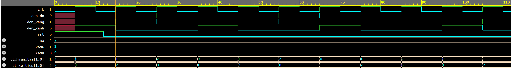

# VLSI Journey

Self-study journey into VLSI / IC Design, focused on Design Verification (DV).

- **Started:** June 15, 2026
- **Major:** Computer Science - HCMUT
- **Goal:** Land an IC Design Verification (DV) internship

## Tools
- Icarus Verilog (simulation) + VaporView / EDA Playground (waveform viewing)

## Progress
### Week 1 - Number systems & basic Verilog
- [x] Number systems, 2's complement, K-maps
- [x] Toolchain setup
- [x] 2:1 mux + testbench + waveform
- [x] Full adder

### Week 2 - Verilog Language (30+ HDLBits problems)
- [x] Basics (gates, wires)
- [x] Vectors (part select, concatenation, replication)
- [x] Modules: Hierarchy (instantiation, adders)
- [x] Procedures (always blocks, if/case, avoiding latches)
- [ ] Conditional + FSM (in progress)

### Week 3 - FSM (Finite State Machines)
- [x] FSM concepts (Moore/Mealy, state diagrams)
- [x] traffic_light FSM (Moore: XANH -> VANG -> DO)
- [ ] sequence detector "1011"

## Week 3 Demo - Traffic Light FSM
Simulation waveform (Icarus Verilog + EPWave). The state `tt_hien_tai` cycles
`0 -> 1 -> 2` (XANH -> VANG -> DO) on each rising clock edge, and the lights follow.

## Structure
- `test/` - mux2 (2:1 multiplexer)
- `week1/` - full_adder (1-bit adder)
- `week3/` - traffic_light FSM
- `notes/` - study notes

